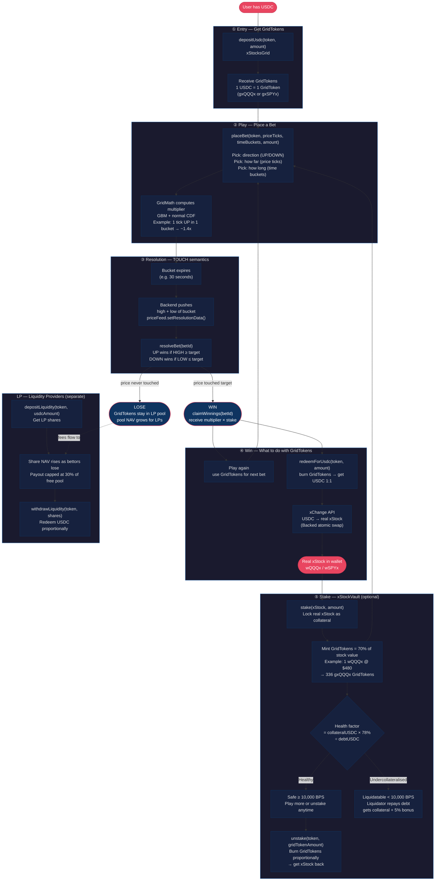

# xStocks Grid — User Flow



---

## At a Glance

| Step | Who | Action | Result |
|------|-----|--------|--------|
| 1 | User | `depositUsdc(wQQQx, 100_000_000)` | Receive 100 gxQQQx GridTokens |
| 2 | User | `placeBet(wQQQx, +1, 1, 50e18)` | Bet 50 GT that QQQ rises 1 tick in 30s |
| 3 | Backend | `setResolutionData(wQQQx, expiry, close, high, low)` | Push bucket high/low on-chain |
| 4a | Anyone | `resolveBet(betId)` — if high ≥ target | Mark won |
| 4b | User | `claimWinnings(betId)` | Receive ~70 GT (≈1.4x multiplier) |
| 5a | User | `redeemForUsdc(wQQQx, 70e18)` | Receive $70 USDC |
| 5b | User | xChange API + `executeSwap()` | Receive real wQQQx in wallet |
| 6 | User | `stake(wQQQx, 1e18)` (if wQQQx ≈ $480) | Receive 336 gxQQQx GridTokens (70%) |
| 7 | User | `placeBet(...)` again | Cycle repeats |

## Key Invariants

```
1 GridToken  =  1 USDC  (always 1:1, maintained by deposit/redeem)
Stake LTV    =  70%     (stake $480 stock → 336 GridTokens)
Liq trigger  =  78%     (gridTokensMinted > collateral × 78%)
Liq bonus    =  5%      (liquidator gets debt tokens + 5% extra collateral)
```
